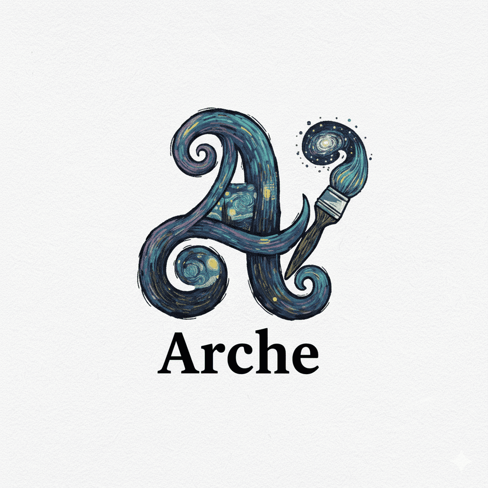

<div align="center">
  
  
  <h1>Arche — The Origin of Every Idea</h1>
  
  <p>
    <strong>Trace the lineage of creativity. Register your AI-born assets as Programmable IP.</strong>
  </p>
</div>

---

## 🌌 The Vision

**Arche** isn't just another AI image generator. It is a **provenance layer for creativity**. 

Inspired by the chaotic yet structured strokes of Van Gogh, Arche recognizes that an artwork isn't just the final pixel—it's the prompt, the seed, the iterations, and the creative choices made along the way. We bridge the gap between ephemeral AI generation and permanent, verifiable ownership using **Story Protocol**.

> "We remember not only the art, but the journey that birthed it."

## ✨ Unique Value Proposition

In the age of infinite reproduction, Arche restores value to the **origin**:

1.  **Provenance as First-Class Citizen**  
    Unlike standard tools that discard your draft history, Arche visualizes your creative path. Using a graph-based data structure, we track every prompt mutation and variation, creating a genealogy of your artwork.

2.  **Programmable IP (Story Protocol Integration)**  
    We don't just "save" images. We mint them as **IP Assets (IPA)** on-chain. This transforms your AI generations into liquid, programmable intellectual property that can be licensed, remixed, and monetized.

3.  **The Graph of Creation**  
    Visualize the relationship between your assets. See how "Prompt A" evolved into "Masterpiece B". Your creative history is no longer a flat list, but a living, breathing network of ideas.

## 🚀 Key Features

### 🎨 **Studio & Canvas**
- **Flow-State Interface:** An immersive environment designed for rapid iteration without distraction.
- **AI-Native Tools:** Generate, refine, and mutate assets using state-of-the-art models.
- **Context Awareness:** The system remembers previous iterations, allowing for coherent style evolution.

### 🕸️ **Provenance Graph**
- **Visual Lineage:** A node-based view showing the ancestry of every generated image.
- **Non-Linear History:** Branch out your ideas without losing the original concept.
- **Metadata Preservation:** Every version retains its prompt, model parameters, and seed.

### 🛡️ **On-Chain Registry (Story Protocol)**
- **One-Click Registration:** Seamlessly bridge your final selection to the blockchain.
- **Verifiable Authorship:** Proof of creation timestamped and secured on Story Protocol.
- **IP Licensing:** Set terms for how others can use or remix your work (Commercial, Non-Commercial, etc.).

## ⚡ Tech Stack

Arche is built with a modern, high-performance stack designed for scalability and smooth interaction.

- **Frontend:** [Next.js 16](https://nextjs.org/) (App Router) & [React 19](https://react.dev/)
- **IP Infrastructure:** [Story Protocol](https://www.story.foundation/)
- **Database & Graph:** [Neo4j](https://neo4j.com/) (for handling complex provenance relationships)
- **Styling:** [Tailwind CSS 4](https://tailwindcss.com/)
- **Motion & 3D:** 
  - [GSAP](https://gsap.com/) (ScrollTrigger & Animations)
  - [Lenis](https://lenis.studiofreight.com/) (Smooth Scrolling)
  - [OGL](https://github.com/oframe/ogl) (WebGL enhancements)

## 🏁 Getting Started

### Prerequisites

- Node.js 20+
- Docker (for Neo4j local instance)

### Installation

1. Clone the repository:
```bash
git clone <repository-url>
cd arche-fe
```

2. Install dependencies:
```bash
npm install
```

3. Start the development server:
```bash
npm run dev
```

4. Open [http://localhost:3000](http://localhost:3000) to begin your journey.

## road
## 🛣️ Roadmap

- [x] **Core Studio Engine:** Prompt-to-image generation loop.
- [x] **Graph Visualization:** Interactive provenance tree.
- [ ] **Story Protocol Integration (Phase 2):**
    - [ ] [See Phase 2 Integration Plan](docs/PHASE_2_INTEGRATION_PLAN.md)
    - [ ] Genesis IP Minting (`mintAndRegisterIp`)
    - [ ] License Tokenization (`mintLicenseTokens`)
    - [ ] Derivative Registration (`registerDerivativeIp`)
- [ ] **Community Gallery:** Remix and branch from other artists' public IP.

## 🎨 Design Philosophy

Arche's aesthetic is a tribute to the post-impressionist spirit—merging the organic with the digital.
- **Midnight Blues:** Represents the depth of the creative subconscious.
- **Auric Strokes:** Symbolizes the spark of inspiration found in the noise.

## License

Private Project. All rights reserved.